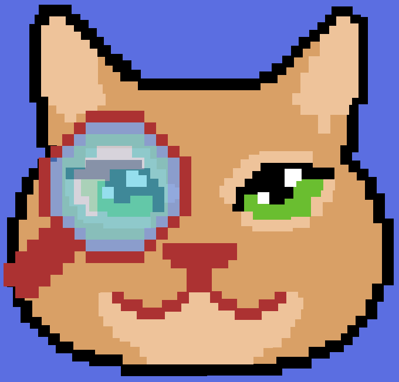
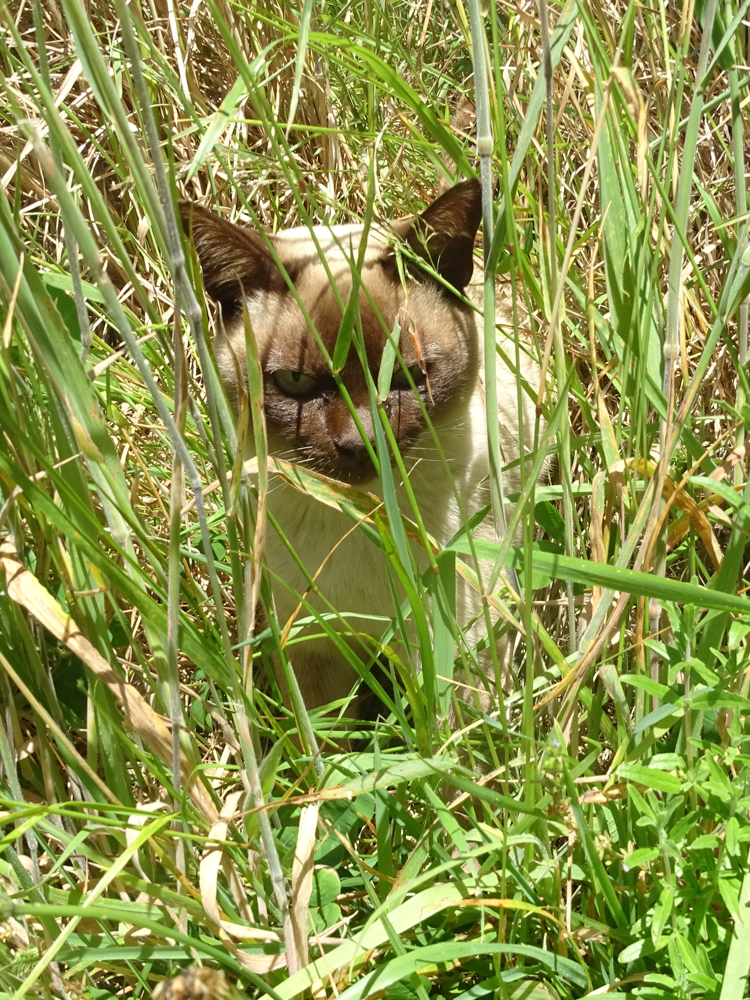

<!-- PROJECT LOGO -->
<br />
<div align="center">
  <a href="https://github.com/ThomasR39/clever-cat-classifier">
    
  </a>
  <h3 align="center">Clever Cat Classifier</h3>
  <p align="center">
    iOS app to detect cat breeds
    <br />
    <a href="https://github.com/ThomasR39/clever-cat-classifier"><strong>Explore the docs »</strong></a>
    <br />
    <br />
    <a href="https://github.com/ThomasR39/clever-cat-classifier/blob/main/assets/demo.gif">View Demo</a>
    ·
    <a href="https://github.com/ThomasR39/clever-cat-classifier/issues">Report Bug</a>
    ·
    <a href="https://github.com/ThomasR39/clever-cat-classifier/issues">Request Feature</a>
  </p>
</div>

<!-- TABLE OF CONTENTS -->
<details>
  <summary>Table of Contents</summary>
  <ol>
    <li>
      <a href="#about-the-project">About The Project</a>
      <ul>
        <li><a href="#built-with">Built With</a></li>
      </ul>
    </li>
    <li>
      <a href="#getting-started">Getting Started</a>
      <ul>
        <li><a href="#prerequisites">Prerequisites</a></li>
        <li><a href="#installation">Installation</a></li>
      </ul>
    </li>
    <li>
      <a href="#contributing">Contributing</a>
    </li>
    <li><a href="#license">License</a></li>
    <li><a href="#information-on-convolutional-neural-networks">Convolutional Neural Networks</a></li>
    <li><a href="#acknowledgments">Acknowledgments</a></li>
  </ol>
</details>

<!-- ABOUT THE PROJECT -->
## About The Project

Clever Cat Classifier is an iOS app that uses a <a href="#information"> Convolutional Neural Network </a> model created with Core ML to classify cat breeds. The model that this app uses for classification was trained on images from <a href="#acknowledgments">Cat Breeds Dataset</a> on Kaggle.

Clever Cat Classifier uses a Convolutional Neural Network to process an image and outputs the probability of the cat in the image belonging to a specific breed.

This app makes use of two different models. First, the input image is passed through a model that will tell whether a cat is present in the image. If the initial model detects a cat, then we pass the image as input to the second model which outputs the breed of the cat in the image.

The code used to train the model is not available in this repository. As I tune the model to a better state I will release the code to generate the model. 

### Built With

* [Xcode](https://developer.apple.com/xcode/)
* [Swift](https://github.com/apple/swift)
* [Core ML](https://developer.apple.com/documentation/coreml)

<!-- GETTING STARTED -->
## Getting Started

### Prerequisites

Clever Cat Classifier was built using Swift 5.5 and Xcode version 13.1

### Installation

Clone this repository and open it in Xcode.

```bash
git clone https://github.com/thomasr39/clever-cat-classifier.git
cd clever-cat-classifier
open -a Xcode clever-cat-classifier.xcodeproj
```

See the [open issues](https://github.com/ThomasR39/clever-cat-classifier/issues) for a full list of proposed features (and known issues).

<!-- CONTRIBUTING -->
## Contributing

Pull requests are welcome. For major changes, please open an issue first to discuss what you would like to change.

<!-- LICENSE -->
## License
Distributed under the MIT License. See <a href="https://github.com/ThomasR39/clever-cat-classifier/blob/main/LICENCE">LICENSE</a> for more information.

<!-- INFORMATION -->
## Information on Convolutional Neural Networks
- https://www.ibm.com/cloud/learn/convolutional-neural-networks
- Bishop, Christopher M, _Pattern Recognition and Machine Learning_, (Springer, 2006), p. 267.

<!-- ACKNOWLEDGMENTS -->
## Acknowledgments

Thank you to:

* [Cat Breeds Dataset](https://www.kaggle.com/ma7555/cat-breeds-dataset) for the data set that was used to create the model.
* Meyagi and Rose for the inspirational meows.

</img>
</img>
